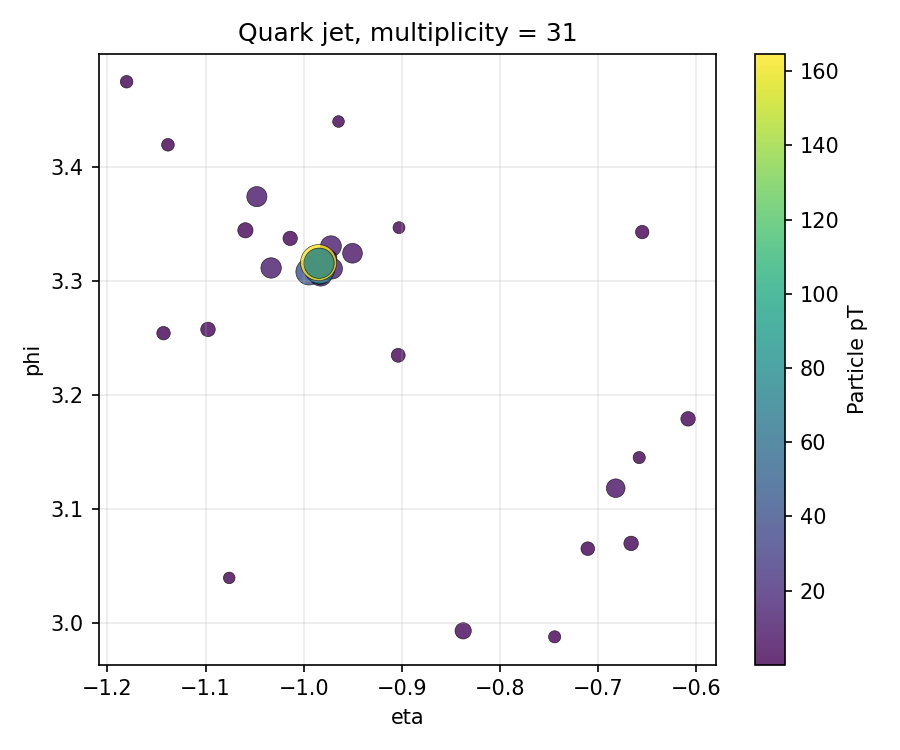
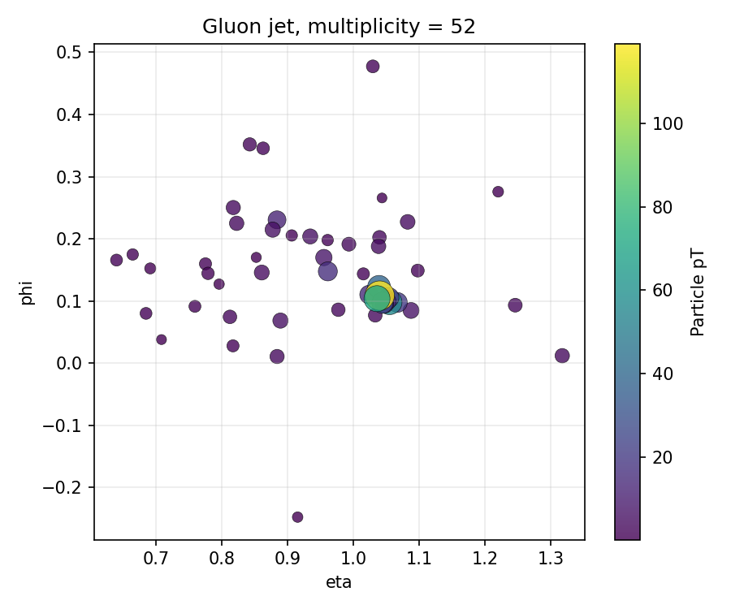
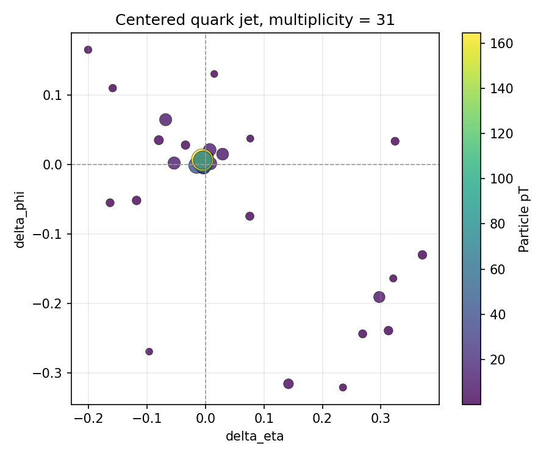
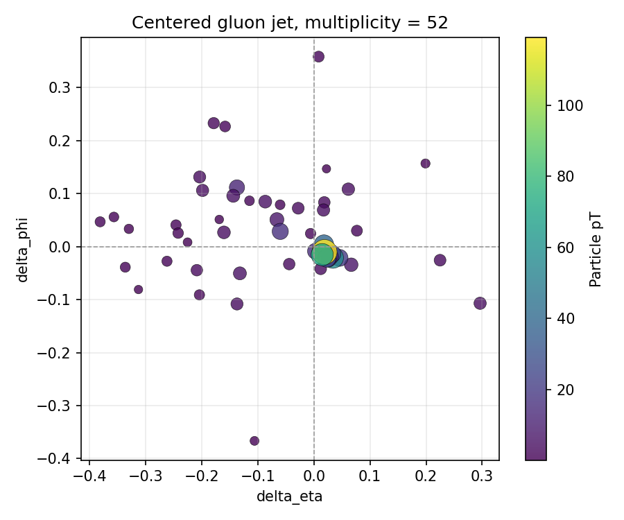
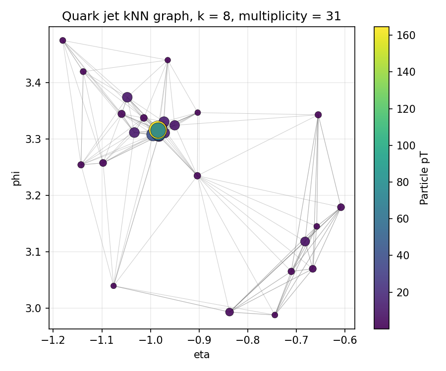
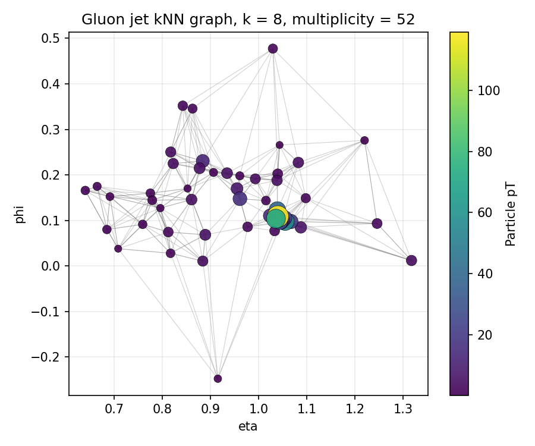
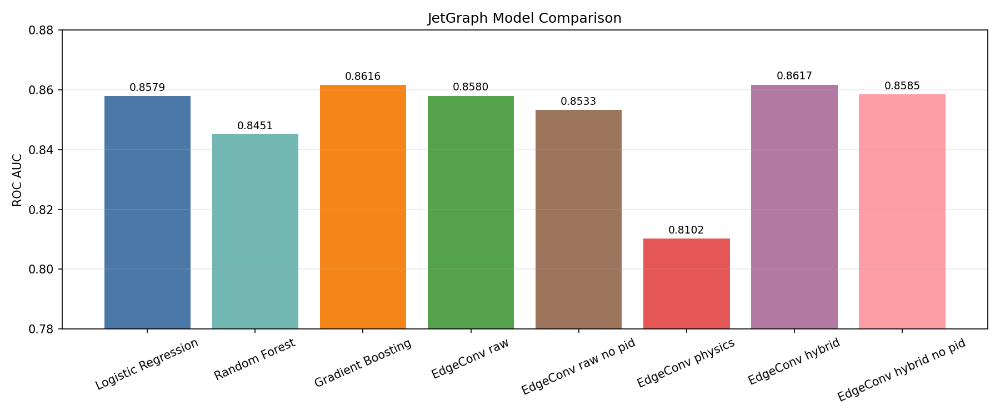
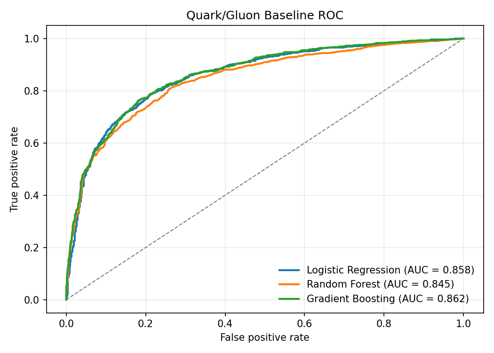
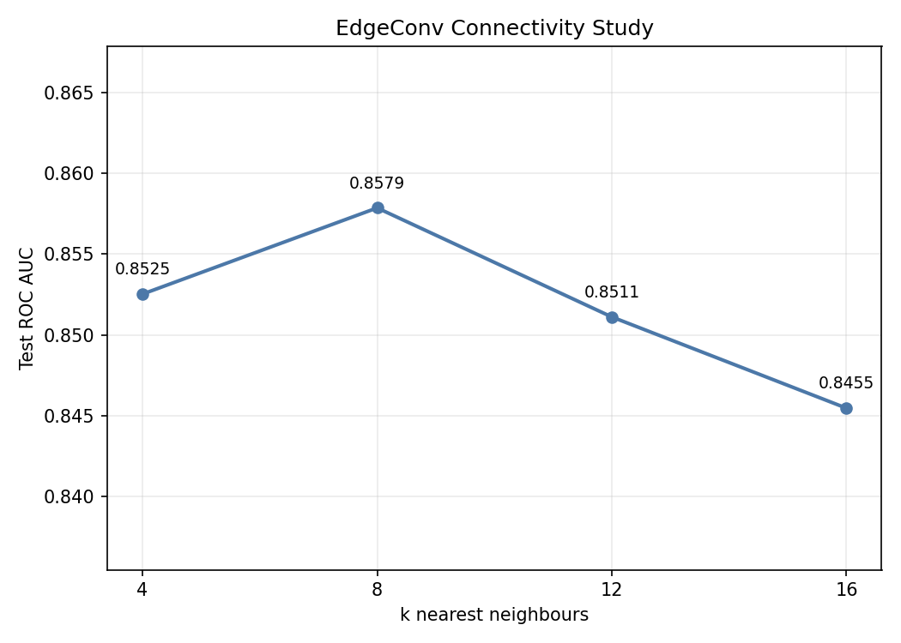
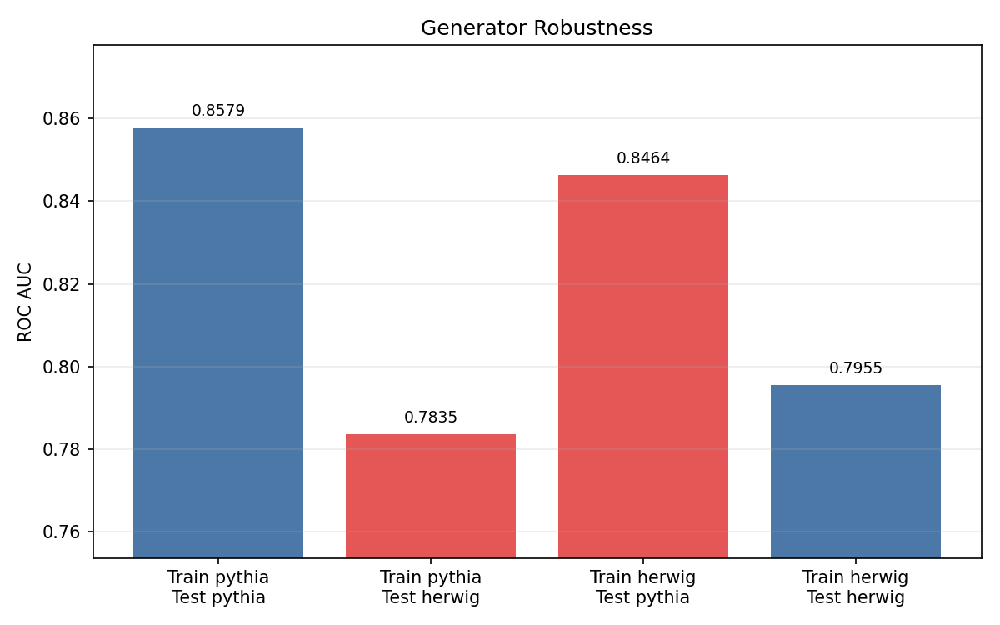

# JetGraph

**Particle-level graph learning for quark/gluon jet tagging.**

JetGraph is a compact, reproducible HEP/ML project studying quark/gluon
discrimination with the EnergyFlow `qg_jets` dataset. It starts from
physics-inspired baseline observables, builds particle-level k-nearest-neighbour
graphs, trains a simple EdgeConv graph neural network, and evaluates feature,
connectivity, particle-identity, and generator-robustness ablations.

The project is designed as a scientific portfolio piece: interpretable baselines
come first, graph learning is introduced incrementally, and every model
comparison is tied back to physics assumptions.

## Key Findings

- Simple physics observables are already strong: gradient boosting reaches
  ROC AUC 0.8616.
- A first EdgeConv GNN with hybrid node features reaches comparable performance:
  ROC AUC 0.8617 on the Pythia test set.
- Feature representation matters: relative physics-only features underperform,
  while hybrid absolute-and-relative features recover the best result.
- Particle identity information provides a modest gain, but most discrimination
  is carried by kinematics and geometry.
- Moderate graph connectivity works best in the first sweep: `k=8` gives the
  strongest AUC among `k = 4, 8, 12, 16`.
- Pythia-vs-Herwig tests show clear generator dependence, making robustness a
  central next step.

## Physics Motivation

Jets are collimated sprays of particles produced by energetic quarks and gluons.
Because gluons carry a larger color factor than quarks, gluon-initiated jets tend
to radiate more, leading to higher particle multiplicity and broader energy
flow. Quark/gluon tagging is therefore a natural benchmark for studying how
machine-learning models use jet substructure.

JetGraph compares two complementary views of a jet:

- global observables such as multiplicity, jet mass, and angular widths
- particle-level graphs that encode local neighbourhoods in the eta-phi plane

## Pipeline Overview

```text
EnergyFlow qg_jets
        |
        v
Padded particle arrays: (pT, eta, phi, pid)
        |
        +--> Physics observables --> sklearn baselines
        |
        +--> Remove padded particles
                |
                v
            kNN graph in eta-phi
                |
                v
            EdgeConv GNN classifier
```

The main workflow is implemented as numbered scripts:

| Step | Script | Purpose |
|---|---|---|
| 1 | `scripts/01_load_qg_dataset.py` | Load EnergyFlow qg_jets and compute observables |
| 2 | `scripts/02_baseline_bdt.py` | Train observable-only baseline classifiers |
| 3 | `scripts/03_build_graph_dataset.py` | Build PyTorch Geometric graph datasets |
| 4 | `scripts/04_train_gnn.py` | Train the first EdgeConv classifier |
| 5 | `scripts/05_compare_models.py` | Plot model comparison |
| 6 | `scripts/06_k_study.py` | Scan graph connectivity parameter `k` |
| 7 | `scripts/07_generator_robustness.py` | Test Pythia-vs-Herwig generalization |

## Dataset

The default sample contains 10,000 jets from `energyflow.datasets.qg_jets`.
Each jet is represented by padded particle constituents with columns:

```text
pT, eta, phi, pid
```

Padded particles are removed with `pT <= 0`. The primary development sample uses
Pythia, while Herwig is used to study generator dependence.

## Baseline Observables

The observable baseline uses five physics-motivated jet features:

- particle multiplicity
- total scalar pT
- approximate jet mass from massless constituent four-vectors
- pT-weighted eta width
- pT-weighted phi width

These features provide an interpretable benchmark before graph learning.

## Graph Construction

Each jet is converted into a PyTorch Geometric `Data` object. Nodes correspond to
particles, and directed edges connect each particle to its `k` nearest neighbours
in wrapped eta-phi space. The default graph uses `k=8`.

Supported node-feature modes include:

| Mode | Node features |
|---|---|
| `raw` | `pT, eta, phi, pid` |
| `physics` | `log(pT), pT fraction, delta_eta, delta_phi, delta_R, pid` |
| `hybrid` | `pT, log(pT), pT fraction, eta, phi, delta_eta, delta_phi, delta_R, pid` |
| `raw_no_pid` | `pT, eta, phi` |
| `hybrid_no_pid` | hybrid features without `pid` |

## Jet and Graph Visualization

Jets are represented as unordered particle clouds in eta-phi space. Marker size
is proportional to particle pT, making the hardest constituents visually stand
out. The kNN graph overlays show how local graph connectivity is imposed before
the EdgeConv model sees the event.

| Quark jet | Gluon jet |
|---|---|
|  |  |

| Centered quark jet | Centered gluon jet |
|---|---|
|  |  |

| Quark kNN graph, k=8 | Gluon kNN graph, k=8 |
|---|---|
|  |  |

The centered displays use delta_eta and delta_phi relative to the pT-weighted
jet axis, making the internal width and radiation pattern easier to compare.

The kNN edges define local neighbourhoods between particles. This graph
construction provides the input representation for the EdgeConv classifier:
particles are nodes, neighbourhood relations are edges, and learned messages
propagate through the eta-phi structure of the jet.

## EdgeConv Architecture

The first GNN is intentionally minimal:

```text
EdgeConv -> ReLU -> EdgeConv -> ReLU -> global mean pooling -> MLP classifier
```

It is trained with cross-entropy loss for binary classification. This keeps the
architecture simple enough for controlled ablations while still using local
particle-neighbour information.

## Results Summary

### Model Comparison

| Model | ROC AUC |
|---|---:|
| Logistic regression | 0.8579 |
| Random forest | 0.8451 |
| Gradient boosting | 0.8616 |
| EdgeConv raw | 0.8580 |
| EdgeConv raw no pid | 0.8533 |
| EdgeConv physics | 0.8102 |
| EdgeConv hybrid | 0.8617 |
| EdgeConv hybrid no pid | 0.8585 |



### Baseline Performance



The observable-only baselines are highly competitive. This is an important
physics sanity check: global radiation-pattern observables already encode much
of the quark/gluon separation.

### Feature Ablation

Raw graph features perform well, physics-only relative features underperform,
and hybrid features recover the best result. This shows that graph-based jet
tagging is sensitive not only to architecture, but also to the coordinate system
and normalization used for particle features.

### Particle Identity Ablation

Removing `pid` gives a modest performance drop:

| Comparison | ROC AUC with pid | ROC AUC without pid |
|---|---:|---:|
| Raw features | 0.8580 | 0.8533 |
| Hybrid features | 0.8617 | 0.8585 |

Most discrimination is carried by kinematics and local geometry, while particle
identity adds a small complementary gain.

### Graph Connectivity Study

Using hybrid node features, the k-nearest-neighbour connectivity sweep gives:

| k | Test accuracy | Test ROC AUC |
|---:|---:|---:|
| 4 | 0.7653 | 0.8525 |
| 8 | 0.7707 | 0.8579 |
| 12 | 0.7720 | 0.8511 |
| 16 | 0.7640 | 0.8455 |



The best AUC is obtained at `k=8`, suggesting that moderate local connectivity
captures useful particle-neighbour structure without adding too many
less-informative edges.

### Generator Robustness

| Train generator | Test generator | Accuracy | ROC AUC |
|---|---|---:|---:|
| Pythia | Pythia | 0.7707 | 0.8579 |
| Pythia | Herwig | 0.7147 | 0.7835 |
| Herwig | Pythia | 0.7693 | 0.8464 |
| Herwig | Herwig | 0.7053 | 0.7955 |



The Pythia-trained model drops substantially on Herwig, indicating generator
dependence. Cross-generator validation is therefore essential before interpreting
high in-domain performance as robust physics learning.

## Physics Interpretation

The strongest lesson is that quark/gluon discrimination is not purely a
black-box graph-learning problem. Interpretable observables already encode
important QCD differences: gluon jets tend to be broader and more populated than
quark jets. The EdgeConv model becomes competitive when its node features retain
both absolute kinematics and jet-relative geometry.

The weaker performance of physics-only relative features suggests that removing
absolute information too aggressively can discard useful structure. The
pid/no-pid study shows that particle identity helps, but only modestly. The
generator-robustness study is the most important caveat: a model can learn
features that separate quarks and gluons within one simulator while losing
performance across generators.

## Quick Start

Create the environment:

```bash
conda env create -f environment.yml
conda activate jetgraph
```

Run the main pipeline:

```bash
python scripts/01_load_qg_dataset.py
python scripts/02_baseline_bdt.py
python scripts/03_build_graph_dataset.py --feature-mode hybrid
python scripts/04_train_gnn.py --input data/processed/qg_graphs_k8_hybrid.pt
python scripts/05_compare_models.py
```

Optional studies:

```bash
python scripts/06_k_study.py
python scripts/07_generator_robustness.py
```

## Project Structure

```text
configs/          # YAML configuration files
data/
├── raw/          # cached source datasets
└── processed/    # generated arrays, graphs, and result CSVs
scripts/          # reproducible command-line workflows
src/jetgraph/
├── data/         # dataset loading
├── graphs/       # graph construction and node features
├── models/       # GNN architectures
├── training/     # training and evaluation loops
├── evaluation/   # plotting helpers
├── physics/      # physics observables
└── utils/        # utilities
figures/          # generated plots
reports/          # scientific writeups
```

## Future Work

- Implement a ParticleNet-like architecture with dynamic graph recomputation.
- Add feature standardization and train-set-only normalization for graph nodes.
- Tune hidden dimensions, dropout, learning rate schedules, and pooling choices.
- Study larger EnergyFlow samples and repeated random seeds.
- Add uncertainty estimates and calibration diagnostics.
- Improve Pythia-vs-Herwig robustness with domain-adversarial or mixed-generator
  training.
- Extend the report into a polished PDF note with figures and references.

## Report

A concise scientific report is available at:

[reports/jetgraph_report.md](reports/jetgraph_report.md)
